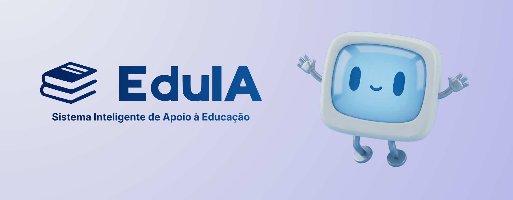

<div align='center'>
    
</div>

## 📚 O que é o EduIA

O **EduIA** é um sistema de geração de materiais de estudo com **IA** (Inteligência Artificial), desenvolvido por estudantes do ensino médio técnico integrado do **IFRN** - campus Caicó. O sistema visa reduzir o tempo gasto por alunos e professores, gerando questões e planos de aula.

<!-- Imagem ou GIF do sistema -->

### 📖 Materiais gerados

O sistema gera diversos materiais que são distribuídos entre professores e alunos. Abaixo está uma tabela com todos os materiais que são gerados.

| Material               | Como funciona                                                                                              |
| ---------------------- | ---------------------------------------------------------------------------------------------------------- |
| **Questões**           | Listas de exercícios com quantidade e nível especificados pelo usuário                                     |
| **Formulários**        | Formulários com quantidade e nível especificados pelo usuário                                              |
| **Quiz**               | Quizzes com pontuação e tempo estabelecidos pelo usuário                                                   |
| **Flashcards**         | Cartões com perguntas simples e suas respostas                                                             |
| **Resumos**            | Resumo de um determinado assunto ou matéria                                                                |
| **Explicações**        | Explicação de um assunto ou matéria para diferentes níveis, podendo usar analogias e demonstrar aplicações |
| **Exercícios guiados** | Questões já respondidas, com passo a passo e explicações detalhadas                                        |
| **Planos de aula**     | Base do que deve ser abordado na aula em questão                                                           |
| **Roteiros de estudo** | Contém o que deve ser estudado e em qual sequência                                                         |
| **Desafios**           | Desafios para cada assunto ou matéria                                                                      |

### ⚒️ Tecnologias

Devido à complexidade do sistema, foi necessária mais de uma tecnologia para a elaboração. Abaixo está uma tabela com as tecnologias usadas.

> [!NOTE]
> Para mais detalhes, vá ao documento de [requisitos não funcionais](docs/requisitos_nao_funcionais.md).

| Tecnologia   | Funcionalidade                                                           |
| ------------ | ------------------------------------------------------------------------ |
| `Flask`      | microframework `Python` usado na integração com o `frontend` e `backend` |
| `ReactJS`    | Biblioteca `JavaScript` para a criação de interfaces                     |
| `MySQL`      | Banco de dados relacional utilizado para armazenar dados e informações   |
| `LangChain`  | Framework para a orquestração da **LLM**                                 |
| `GPT-5 nano` | Modelo de linguagem desenvolvido pela **OpenAI**                         |

### 🧠 IA

A **IA** é o coração do projeto. Optamos por usar um modelo de linguagem pela sua capacidade de adaptação e generalização dos dados absorvidos durante o treinamento. Para que ela se adaptasse aos nossos dados, não a retreinamos; utilizamos **RAG** (Retrieval-Augmented Generation), ou geração aumentada de recuperação.

---

## ▶️ Como executar o projeto

Para executar o projeto, há duas formas:

- **🧑‍💻 Modo desenvolvedor:** O modo desenvolvedor consiste em iniciar ambos os servidores (servidor do `Flask` e o servidor do `React`), possibilitando alterações em tempo real;
- **🐋 Modo deploy com `Docker`:** O modo deploy é indicado para quando o projeto estiver pronto para produção;

> [!IMPORTANT]
> O projeto usa `Flask` e `React`. Ou seja, é necessário ter o `Python` e o `Node` instalados

### 🧑‍💻 Modo desenvolvedor

1. **Clone o repositório e acesse-o**

    ```git
    git clone https://github.com/Davi-1903/EduIA.git
    cd EduIA
    ```

2. **Instale as dependências**

    ```bash
    # Backend
    cd server
    pip install -r requirements.txt

    # Frontend
    cd ../client
    npm install --legacy-peer-deps
    ```

3. **Crie um arquivo `.env` na raiz do projeto para as variáveis de ambiente e adicione**

    ```.env
    SECRET_KEY="<CHAVE SECRETA>"
    DATABASE_URI="mysql+pymysql://root@localhost:<PORTA>/db_eduia"

    # Caso o banco use uma senha
    DATABASE_URI="mysql+pymysql://root:<SENHA>@localhost:<PORTA>/db_eduia"
    ```

4. **Inicie ambos os servidores**

    ```bash
    # Backend
    cd ../server
    python app.py

    # Frontend
    cd ../client
    npm run dev
    ```

> [!TIP]
> Use ambiente virtual 😉

Após finalizar esse passo a passo, a aplicação iniciará em seu navegador padrão em [`http://localhost:3000`](http://localhost:3000)

### 🐋 Modo deploy com `Docker`

Em breve... 🙃

---

## 📄 Documentos

- [Requisitos Funcionais](docs/requisitos_funcionais.md)
- [Requisitos Não Funcionais](docs/requisitos_nao_funcionais.md)
- [Framework e LLM](docs/framework_e_llm.md)

## 😁 Equipe

| Nome                                              | Papel no projeto |
| ------------------------------------------------- | ---------------- |
| [Ana Cecilya](https://github.com/cecilya1)        | Desenvolvedora   |
| [Ana Clara](https://github.com/anaclaraa1)        | Desenvolvedora   |
| [Davi Francisco](https://github.com/Davi-1903)    | Desenvolvedor    |
| [Maria das Graças](https://github.com/mgdantas1)  | Desenvolvedora   |
| [Miguel Tavares](https://github.com/migueltvrs13) | Desenvolvedor    |
| [Romerito Campos](https://github.com/RoCampos)    | Orientador       |

## ⚖️ Licença

O sistema foi construído como **Projeto de Pesquisa e Extensão** pelos alunos do **IFRN** - campus Caicó.

- [Licença MIT](LICENSE)
